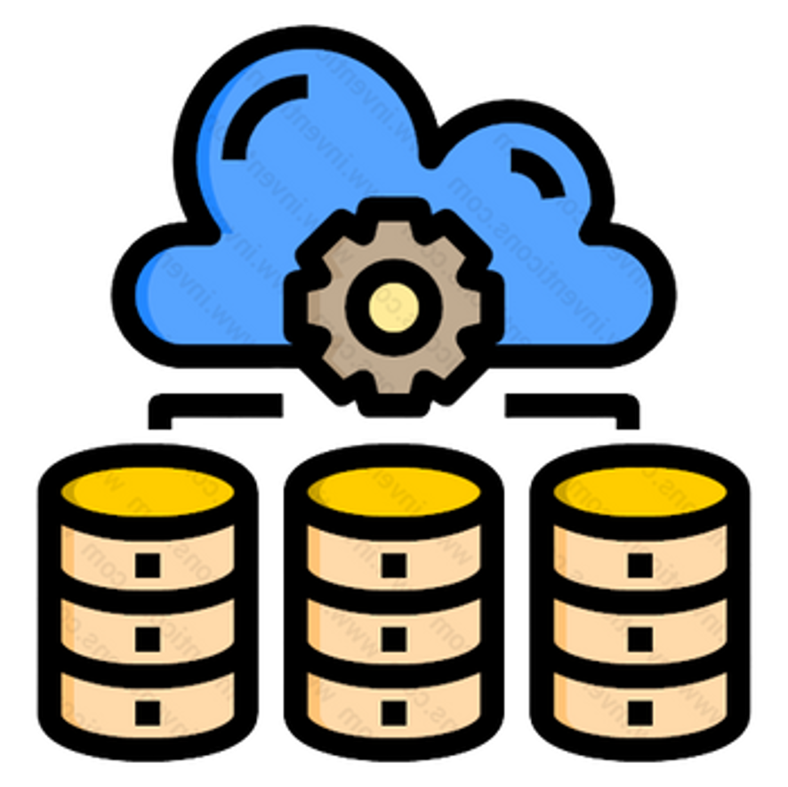
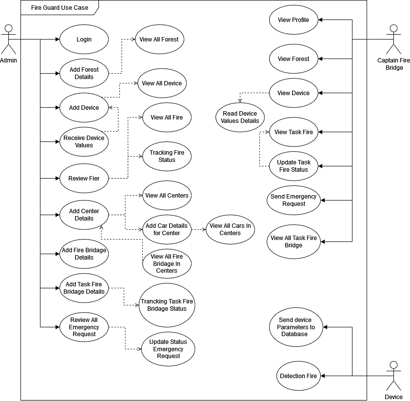
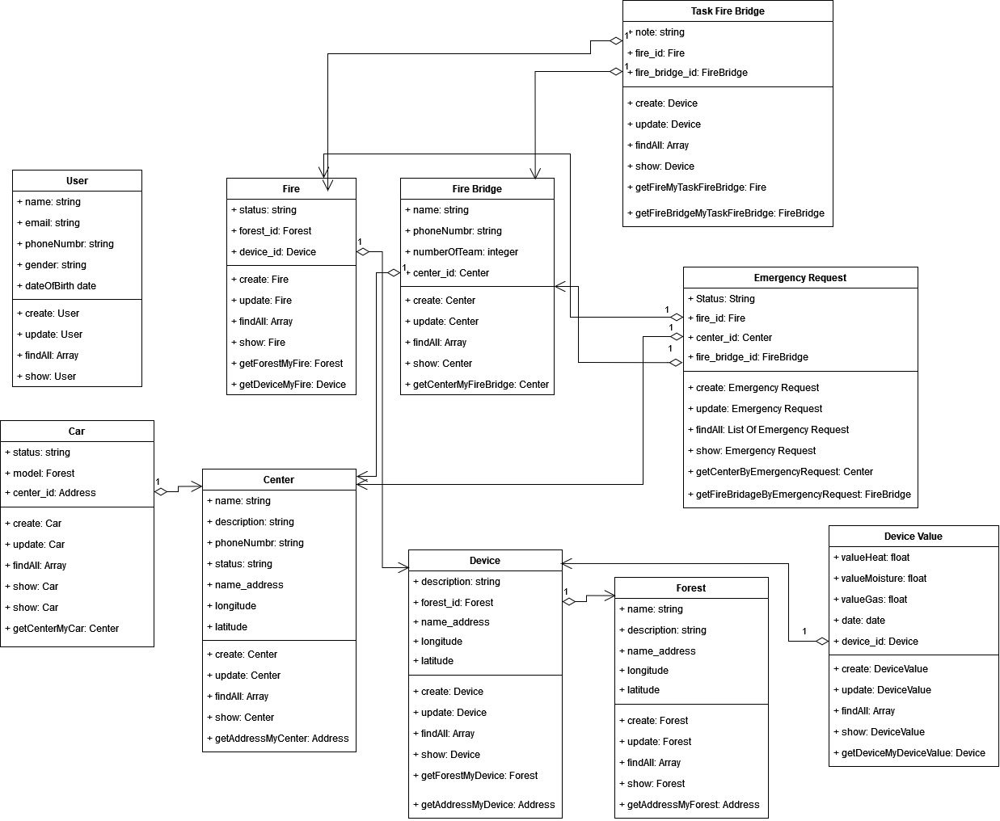
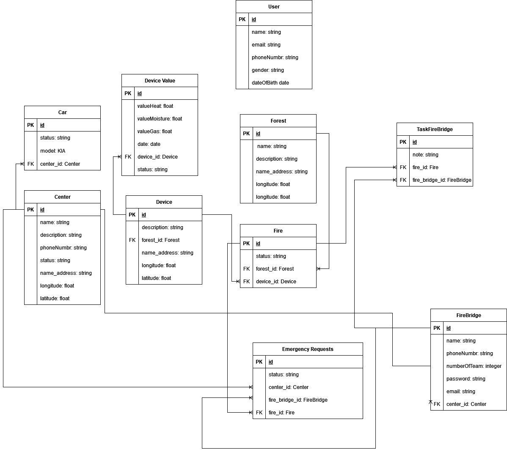
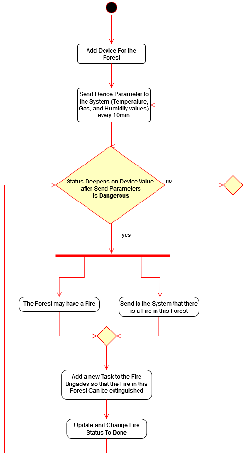
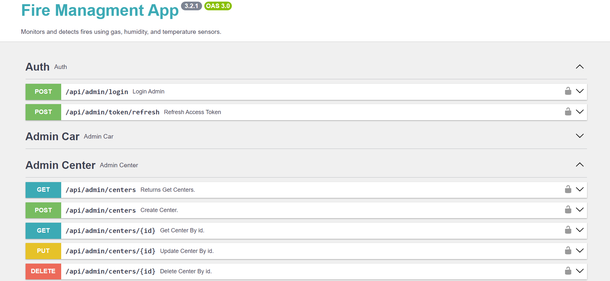
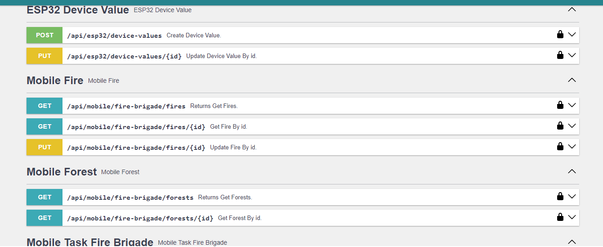

# Fireguard - Backend Server 

  

**Project Name:** Fireguard 

**Component:** Backend Server  

**Date:** 2024  

This repository contains the design and implementation process of the **Backend Component** for the **Fireguard** system. The backend is responsible for managing the data from the sensor nodes, processing it, and making it available to the dashboard and mobile application.

---

## Table of Contents
1. [Introduction](#introduction)
2. [The Design Process](#the-design-process)
   1. [Use Case Diagram](#use-case-diagram)
   2. [Class Diagram](#class-diagram)
   3. [ERD (Entity-Relationship) Diagram](#erd-diagram)
   4. [Activity Diagram](#activity-diagram)
3. [Implementation Process](#implementation-process)
4. [Testing Process](#testing-process)
5. [Conclusion](#conclusion)

---

## 1. Introduction 
The **Backend Component** of the **Fireguard** system handles all data transactions between the sensor nodes, gateway, and dashboard. It is responsible for storing sensor data, managing user accounts, and assigning tasks to firefighters. The backend ensures real-time data processing and efficient communication between all parts of the system.

---

## 2. The Design Process 
In the initial phase, we focused on designing the system's structure and relationships. Several UML diagrams were created to visualize the backend's architecture and data flow.

### 2.1 Use Case Diagram 

  

**Description**:  
The use case diagram illustrates the interactions between different users (Captain Fire Bridge, Admin,Device) and the system. Each actor has specific roles:
- **Admin**:
  - Manage user accounts.
  - Oversee system functions.
  - Monitor sensor data in real-time.
  - Assign tasks.
- **Captain Fire Bridge**: Receive tasks and alerts via mobile apps.
- **Device**: Send sensor data,fire detection state.

### 2.2 Class Diagram 

  

**Description**:  
- The class diagram shows the backend's object-oriented structure

- These classes interact through various methods to manage data flow, task assignments, and system status.

### 2.3 ERD (Entity-Relationship Diagram) 

  

**Description**:  
The ERD shows how the database tables are related.

### 2.4 Activity Diagram 

  

**Description**:  
The activity diagram shows the workflow of detecting a fire and responding to it:
1. Sensors collect and send data to the gateway.
2. The gateway sends the data to the backend server.
3. The backend processes the data and updates the dashboard.
4. Fire stations review the data and assign tasks to firefighters.
5. Firefighters receive tasks through the mobile app.

---

## 3. Implementation Process 
The backend was implemented using a combination of **MySQL** and **PHP Symfony** framework to handle CRUD operations and API development. Here is the breakdown of the implementation process:

- **MySQL Database**: We designed and set up the MySQL database to store sensor data, user accounts, tasks, and other necessary information.
- **PHP Symfony Framework**: The CRUD APIs were developed using Symfony, which is known for its flexibility and robustness in creating enterprise-level applications. These APIs handle:
  - Storing sensor data.
  - Creating and managing tasks for firefighters.
  - Managing user authentication and roles.
- **Hosting**: With the help of a CupCoding company, the backend was deployed to an online server, making it accessible for real-time use.

We would like to extend our thanks to them for their support in hosting the server.

---

## 4. Testing Process 

  

To ensure the reliability and correctness of our APIs, we integrated **Swagger UI** for API testing. Swagger provides an interactive interface for testing different API calls, allowing us to verify that all CRUD operations work as expected.

  

### Testing Features:
- **CRUD API Testing**: Testing the ability to create, read, update, and delete sensor data, tasks, and user information.
- **Error Handling**: Ensuring appropriate error messages are returned when necessary (e.g., invalid data or unauthorized access).

Swagger also makes it easier for developers to collaborate on future updates by providing clear API documentation and examples of requests/responses.

---

## 5. Conclusion 
The backend component of the **Fireguard** system is crucial in ensuring that real-time data is collected, stored, and processed efficiently. With well-designed UML diagrams and robust implementation using MySQL and PHP Symfony, the backend is built to scale and support the needs of fire monitoring and prevention in forest environments.

---

We hope this README provides a clear understanding of the design and implementation process for the **Fireguard Backend**. Feel free to explore the code and contribute to the project.
