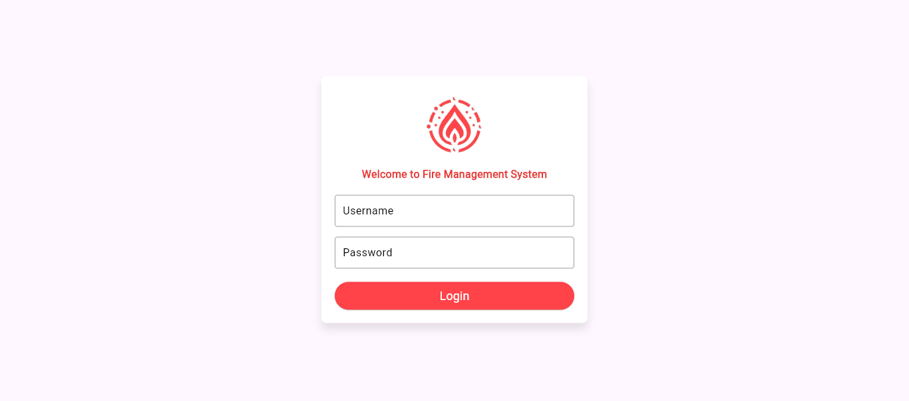
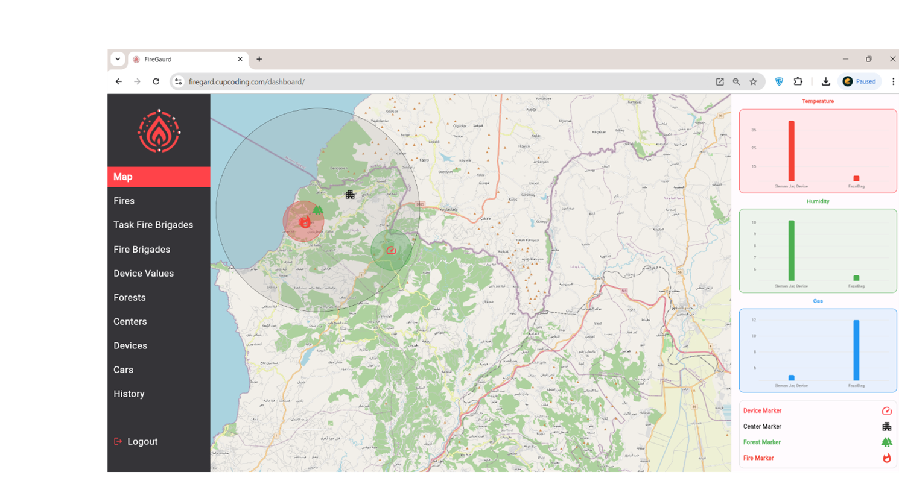
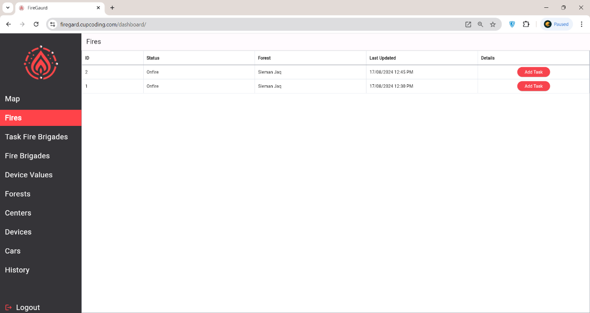
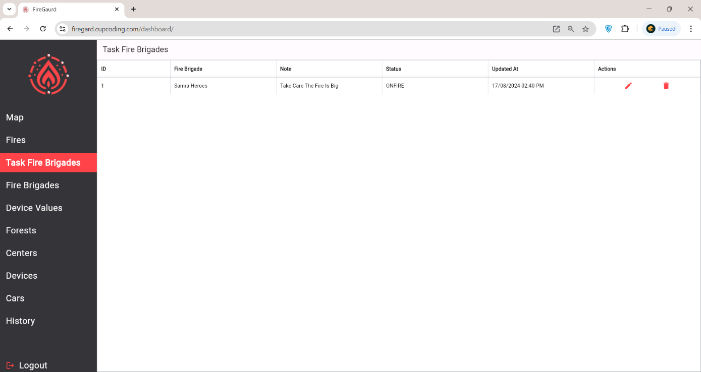
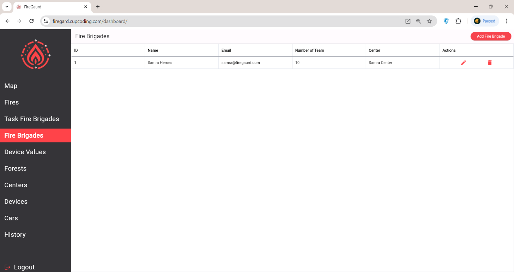
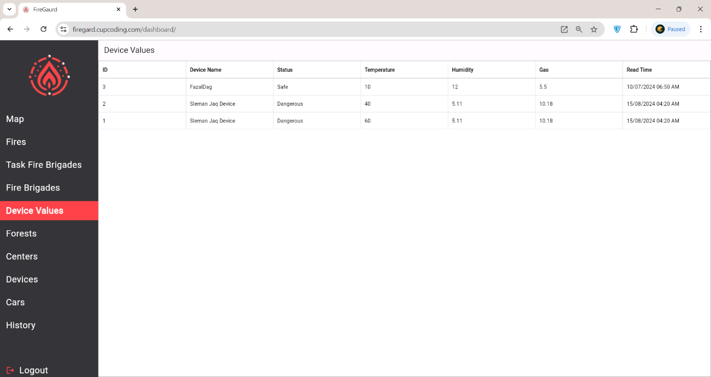
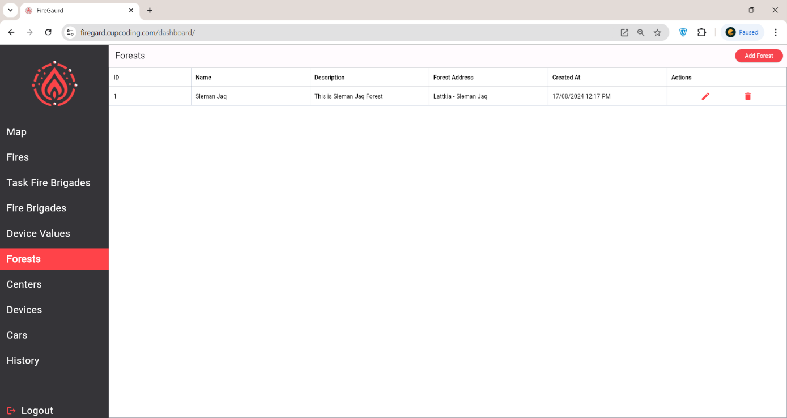
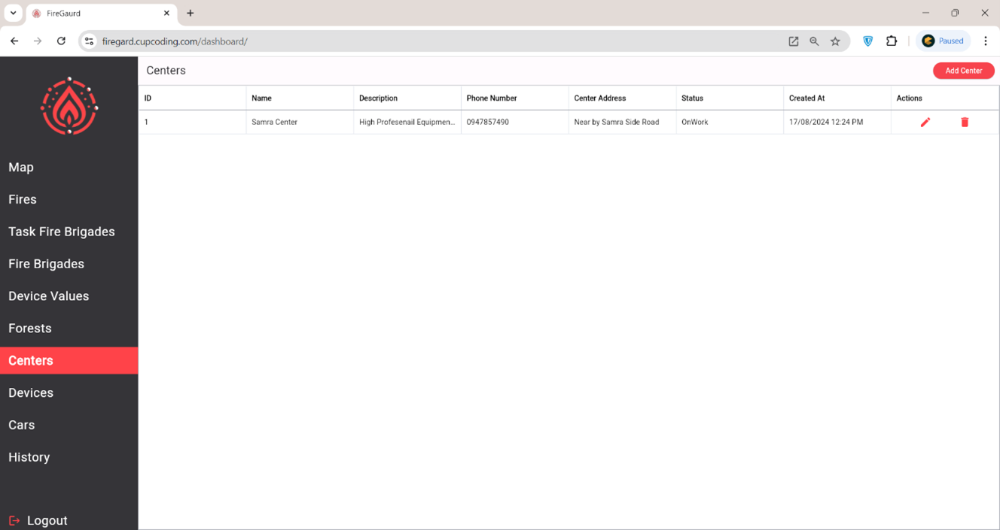
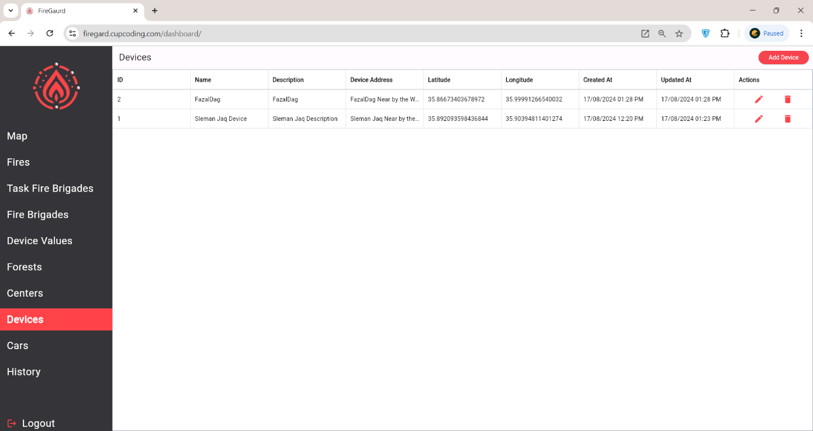

# Fireguard - Dashboard Component

  

**Project Name:** Fireguard 

**Component:** Dashboard  

**Date:** 2024  

This repository contains the design and implementation of the **Dashboard Component** for the **Fireguard** system. The dashboard serves as the interface for fire station monitors to track sensor data, manage tasks, and handle emergencies effectively. 

---

## Table of Contents
1. [Introduction](#introduction)
2. [The Design Process](#the-design-process)
3. [Implementation Process](#implementation-process)
   1. [Login Page](#login-page)
   2. [Home Page](#home-page)
   3. [Fire Alert Page](#fire-alert-page)
   4. [Task Fire Bridge Page](#task-fire-bridge-page)
   5. [Fire Bridge Page](#fire-bridge-page)
   6. [Device Values Page](#device-values-page)
   7. [Forests Page](#forests-page)
   8. [Centers Page](#centers-page)
   9. [Device Page](#device-page)
   10. [Cars Page](#cars-page)
   11. [History Page](#history-page)
4. [Conclusion](#conclusion)

---

## 1. Introduction 
The **Dashboard Component** is an integral part of the **Fireguard** system. It provides fire station monitors with a user-friendly interface to track the status of sensor nodes, monitor forest areas, manage firefighting teams, and respond to fire alerts in real-time. The dashboard is built with ease of use in mind, helping fire stations make timely and effective decisions.

---

## 2. The Design Process 
The dashboard’s UI was carefully crafted using **Figma** to ensure simplicity and clarity. We focused on designing an intuitive interface that presents all essential information clearly and allows the monitor to interact with various components of the system effortlessly.

### Design Features:
- **User-Friendly Interface**: Prioritizes ease of navigation for fire station monitors to respond quickly to alerts.
- **Graphic Identity**: We developed the system’s logo and visual identity (colors, typography, etc.) to create a cohesive look and feel across all components.
- **Color-Coded Status Indicators**: Devices and zones use color-coded indicators (green for safe, red for danger) for immediate identification of fire risks.

---

## 3. The Implementation Process 
The **Fireguard Dashboard** was implemented using **Flutter**, ensuring clean architecture and seamless linking to the backend API. Below are the core pages of the dashboard, each designed for a specific function in the system.

### 3.1 Login Page 

  

**Description**:  
The login page allows authorized users (fire station monitors) to access the dashboard. It includes fields for username and password, with validation to ensure secure access. Upon successful login, users are directed to the **Home Page**.

---

### 3.2 Home Page 

  

**Description**:  
The home page displays a map view of the forest, showing the locations of all sensor nodes. Each sensor node is represented by a circle that changes color based on its status:
- **Green**: Safe
- **Red**: Danger (fire detected)

Additional information such as fire stations, firefighting brigades, and real-time charts of sensor data are also displayed here for easy monitoring.

---

### 3.3 Fire Alert Page 

  

**Description**:  
This page lists the fire alerts received from sensor nodes. Each alert provides details about the fire’s location and severity. The dashboard monitor can assign firefighting tasks to nearby brigades based on these alerts.

---

### 3.4 Task Fire Bridge Page 

  

**Description**:  
This page displays tasks that have been assigned to fire brigades. Each task includes details such as the fire location, severity, and the status of the assigned brigade. Fire station monitors can track task progress and update it as necessary.

---

### 3.5 Fire Bridge Page 

  

**Description**:  
This page lists all firefighting brigades registered in the system. The dashboard monitor can create new brigades and assign tasks to them. Fire brigades can then use the mobile app to receive their assignments.

---

### 3.6 Device Values Page 

  

**Description**:  
This page shows all active sensor nodes and their latest readings, including temperature, humidity, and CO levels. It provides real-time status updates to ensure the dashboard monitor is informed of any changes in forest conditions.

---

### 3.7 Forests Page 

  

**Description**:  
The forests page lists all the forests currently being monitored by the system. The dashboard monitor can add or remove forests from the system as needed.

---

### 3.8 Centers Page 

  

**Description**:  
This page displays data on various firefighting centers registered in the system. The dashboard monitor can manage centers by adding or deleting entries as required.

---

### 3.9 Device Page 

  

**Description**:  
This page allows the dashboard monitor to manage the sensor nodes. New devices can be added, assigned to specific forest locations, or deleted from the system.

---

### 3.10 Cars Page 

**Description**:  
This page shows the fire trucks (or other vehicles) assigned to each fire brigade. The dashboard monitor can track the availability and status of each vehicle.

---

### 3.11 History Page 

**Description**:  
The history page shows logs of previous events, including fire alerts, task assignments, and the responses of firefighting brigades. This allows for performance tracking and future improvements.

---

## 4. Conclusion 
The **Fireguard Dashboard** is a vital tool for fire station monitors, providing real-time insights into forest conditions, fire alerts, and task management. Its intuitive interface ensures that even in high-pressure situations, users can easily navigate through the system and respond effectively to potential fire hazards.

---

We hope this README gives you a clear understanding of the **Dashboard Component**. Feel free to explore the code and contribute to future development.
