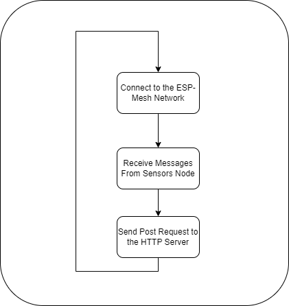

# Fireguard - Gateway 

**Project Name:** Fireguard   
**Component:** Gateway  
**Date:** 2024  

This repository contains the design and implementation process of the **Gateway**, which plays a crucial role in the **Fireguard** system. The Gateway is responsible for receiving data from the sensor nodes, processing it, and forwarding it to the backend server.

---

## Table of Contents
1. [Introduction](#introduction)
2. [The Design Process](#the-design-process)
   1. [Define the Process of the Device](#define-the-process-of-the-device)
   2. [Schematic Design](#schematic-design)
   3. [PCB Design](#pcb-design)
   4. [3D Design](#3d-design)
3. [The Implementation Process](#the-implementation-process)
   1. [Device Software Development](#device-software-development)
   2. [PCB Printing](#pcb-printing)
   3. [3D Model Printing](#3d-model-printing)
   4. [The First Prototype](#the-first-prototype)
4. [Conclusion](#conclusion)
5. [Future Updates](#future-updates)

---

## 1. Introduction 
The **Gateway** is a critical component of the **Fireguard** system. It is designed to receive data from the sensor nodes spread across the forest, process it, and transmit it to the backend server via Wi-Fi. This ensures that real-time data is available for monitoring forest conditions and detecting potential fires. The Gateway is designed to be reliable, efficient, and scalable.

---

## 2. The Design Process 

### 2.1 Define the Process of the Device 

  

The Gateway acts as a bridge between the sensor nodes and the backend server. Its primary responsibilities include:
1. **Data Reception**: Receives environmental data from sensor nodes via Wi-Fi mesh network.
2. **Data Processing**: Organizes and processes the received data to determine priority.
3. **Data Transmission**: Sends the processed data to the backend server via HTTP for storage and further analysis.

### 2.2 Schematic Design 
The schematic design of the gateway is similar to that of the sensor nodes (see [Sensor Nodes Schematic](https://github.com/Izzat-Kawadri/FireGuard/tree/main/Sensor-Nodes#22-schematic-design-)). The gateway is built around the **ESP32** microcontroller, which is responsible for both receiving data from sensor nodes and transmitting it to the backend server.

### 2.3 PCB Design 
The **PCB design** for the gateway follows the same principles as the sensor nodes. The design is compact and efficient, ensuring that the device is capable of reliable long-term operation in remote areas. For detailed PCB design steps, refer to the [Sensor Nodes PCB Design](https://github.com/Izzat-Kawadri/FireGuard/tree/main/Sensor-Nodes#23-pcb-design-) section.

### 2.4 3D Design 
The 3D enclosure for the gateway was designed using **Autodesk Inventor**, ensuring durability and weather resistance in outdoor conditions. The design is identical to the sensor node enclosure, providing protection to the PCB while allowing airflow for proper cooling. For more details, refer to the [Sensor Nodes 3D Design](https://github.com/Izzat-Kawadri/FireGuard/tree/main/Sensor-Nodes#24-3d-design-) section.

---

## 3. The Implementation Process 

### 3.1 Device Software Development 
The software for the gateway was developed using **Arduino IDE**. The code follows a modular structure with separate headers and CPP files for easier debugging and maintainability. The workflow for the gateway is as follows:
1. **Connect to ESP mesh network** using Wi-Fi (PainlessMesh library).
2. **Receive data from sensor nodes** within the network.
3. Process and prioritize the received data.
4. **Send the data to the HTTP server** (backend) via Wi-Fi.
5. Continuously monitor the network for new data from the sensor nodes.

### 3.2 PCB Printing 
The PCB design was exported as Gerber files and sent for fabrication. Once the PCBs were printed, we soldered the components and tested the connections to ensure that the gateway operated as expected. This process is identical to the [Sensor Nodes PCB Printing](#) process.

### 3.3 3D Model Printing 
We printed the 3D model enclosure designed in **Autodesk Inventor** using a 3D printer. The enclosure was tested for proper fitting and protection of the internal components, following the same steps as in the [Sensor Nodes 3D Printing](#) section.

### 3.4 The First Prototype 
For the first prototype, we selected the **ESP32** microcontroller due to its Wi-Fi capabilities and low power consumption. The gateway connects to the ESP mesh network, receives data from the sensor nodes, and sends the data to the backend HTTP server.

After testing the circuit on a breadboard and programming the ESP32 using **Arduino IDE**, we separated the code into headers and CPP files to improve readability and make future updates easier. The first prototype was able to:
- Connect to the mesh network.
- Receive data from multiple sensor nodes.
- Transmit the data to the backend server via HTTP.

The device is still under development, but we are happy to share this stable prototype version.

---

## 4. Conclusion 
The **Fireguard Gateway** is an essential part of the forest fire detection system. Its role in bridging communication between sensor nodes and the backend server ensures that real-time data is available for decision-making. This prototype has successfully demonstrated the system's functionality, and future updates will continue to refine and improve its performance.

---

## 5. Future Updates 
Future updates for the gateway will focus on:
1. **Optimizing data processing** to handle larger volumes of sensor data more efficiently.
2. **Improving power management** for extended operation in remote areas.
3. **Expanding communication protocols** to support additional sensor types and communication methods.

We are committed to enhancing the gateway's capabilities and sharing updates with the community as development progresses.

---

We hope you find this repository useful for understanding the design and implementation of the Fireguard Gateway. Feel free to explore the code and provide feedback!
