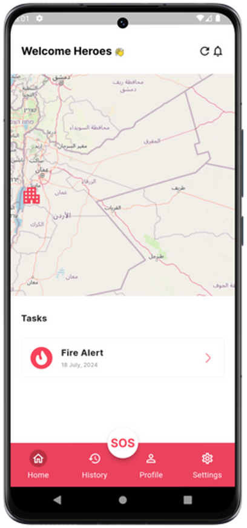

# Fireguard - Mobile App 

  

**Project Name:** Fireguard 

**Component:** Mobile App  

**Date:** 2024  

This repository contains the design and implementation details of the **Mobile App Component** for the **Fireguard** system. The mobile app serves as the interface for fire brigade teams to receive tasks, manage fire alerts, and communicate with the fire station's dashboard. 

---

## Table of Contents
1. [Introduction](#introduction)
2. [The Design Process](#the-design-process)
3. [Implementation Process](#implementation-process)
   1. [Logo Widget](#logo-widget)
   2. [Login Widget](#login-widget)
   3. [Home Widget](#home-widget)
   4. [Task Widget](#task-widget)
   5. [History Widget](#history-widget)
   6. [Profile Widget](#profile-widget)
   7. [Settings Widget](#settings-widget)
4. [Conclusion](#conclusion)

---

## 1. Introduction 
The **Fireguard Mobile App** is designed for firefighting brigades to help them track and manage their tasks in real-time. The app is linked to the system’s backend, enabling firefighting teams to receive tasks, navigate to fire locations, and report progress or emergencies. The app is built with a user-friendly design to ensure that it can be used effectively even during high-pressure situations.

---

## 2. The Design Process 
We designed a simple, user-friendly UI for the mobile app using **Figma**, ensuring easy navigation and quick access to essential functions.

The design focuses on making the interface intuitive for firefighters, with easily accessible sections and a bottom navigation bar for quickly switching between views. The app also includes an **SOS button** for emergencies, allowing the fire brigade to quickly alert the dashboard for help when needed.

---

## 3. Implementation Process 
The mobile app was built using **Flutter**, following clean architecture principles. It is directly connected to the backend to facilitate real-time data exchange with the fire station dashboard.

### 3.1 Logo Widget 

  

The **Logo Widget** is displayed during the splash screen when the app loads. It showcases the **Fireguard** branding and gives a professional look to the app, reinforcing its identity.

---

### 3.2 Login Widget 
The **Login Widget** allows fire brigade members to securely access the app. It includes fields for the username and password, along with validation and error handling to ensure the right personnel can log in. Once authenticated, users are directed to the **Home Widget**.

---

### 3.3 Home Widget 

  

The **Home Widget** is the main page of the app and consists of two sections:

1. **Top Section - Map**:  
   The map shows the current location of the fire brigade and nearby sensor nodes, similar to the dashboard. It displays the status of the nodes (safe or dangerous) and provides a real-time overview of the forest.
   
2. **Bottom Section - Task List**:  
   The bottom section shows a list of tasks assigned to the fire brigade. There’s a **bottom navigation bar** to switch between various views. Additionally, an **SOS button** is placed prominently, allowing the fire brigade to immediately notify the dashboard if they require assistance while handling a fire.

---

### 3.4 Task Widget 
When a fire brigade receives a task, this widget displays details about the task and the path to the fire location. The fire brigade can follow the directions to reach the fire quickly. 

Once at the location, they can mark the task as completed by pressing the **Complete Task** button. If the fire alert turns out to be a false alarm, they can press **Cancel Task** to update the system. This helps the dashboard stay informed and adjust operations accordingly.

---

### 3.5 History Widget 
The **History Widget** shows a list of previous tasks completed by the fire brigade. This page allows users to review past operations and any critical notes that were added. It helps in performance tracking and improving future response strategies.

---

### 3.6 Profile Widget 

  

The **Profile Widget** provides basic information about the logged-in fire brigade team, including their name, email, and current number of the team. It also allows them to log out of the app or update their profile information.

---

### 3.7 Settings Widget 
The **Settings Widget** allows the user to configure app preferences, such as notification settings, language preferences, and account management options. The interface is simple to ensure that firefighters can adjust their settings easily without needing to navigate complex menus.

---

## 4. Conclusion 
The **Fireguard Mobile App** is designed to assist firefighting brigades in managing fire alerts and tasks efficiently. With its user-friendly interface and integration with the **Fireguard** backend, it provides a robust tool for managing emergencies in real-time.

We are excited to share the app with the firefighting teams and look forward to future enhancements, including adding more advanced features like **tinyML** to improve fire detection accuracy.

---

We hope this README provides a comprehensive overview of the **Mobile App Component**. Feel free to explore the repository and contribute to its future development.
