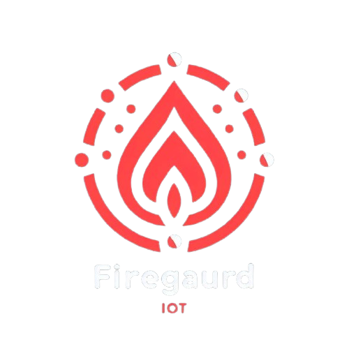
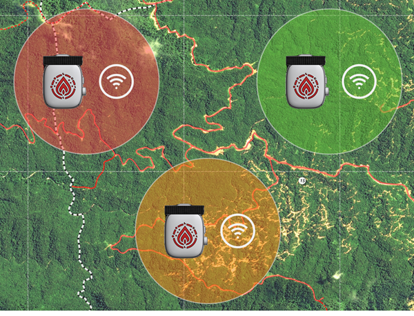

# FireGuard 

  

**Project Name:** FireGuard  
**Graduation Project for:** Faculty of Computer and Automation  
**Project Date:** 2024 

**Inspiration:** The increasing number of forest fires in recent years, especially in Syria, motivated us to develop a project that can detect fires early to minimize their damage.

## Table of Contents
1. [Summary](#summary)
2. [Introduction](#introduction)
3. [The Problem and Its Impact](#the-problem-and-its-impact)
4. [Our Solution](#our-solution)
5. [Scenario](#scenario)
6. [System Components](#system-components)
7. [Block Diagram (DFD)](#block-diagram)
8. [Technology & Hardware Used](#technology--hardware-used)
9. [Results and Conclusion](#results-and-conclusion)
10. [Future Efforts](#future-efforts)
11. [References](#references)
12. [Credits](#credits)

---
## 1. Summary 

  

**Fireguard** demonstrates the power of integrating IoT and WSN technologies in forest fire detection. With sensor nodes actively monitoring environmental conditions and alerting authorities, the system helps reduce fire damage by providing timely and actionable data. The project highlights the application of our skills in IoT, software development, and hardware design, offering a scalable solution to an increasingly relevant global issue

---

## 2. Introduction 
Forest fires have been increasingly devastating over the last few years, destroying thousands of hectares of forest land. In particular, our homeland Syria has faced significant damage from these fires. Early detection and prompt action are essential to minimize the destruction and protect both human lives and natural resources.

---

## 3. The Problem and Its Impact 
The rapid spread of forest fires, combined with delayed detection, often results in large-scale damage. Traditional methods for detecting and reporting fires are slow and inefficient, leading to delays in mobilizing firefighters and other emergency services.

### Impact of the Problem

Over the past years, there has been a sharp increase in the number of fires globally and specifically in Syria. Here are some real data:

- **Year 2020**: Over **500** fires were reported in forests across Syria, with **80,000 hectares** burned.
- **Year 2021**: Fires increased by **25%**, further damaging vast areas.
- **Year 2022**: **10% more** fires, causing irreversible environmental harm.

These statistics underscore the urgency for a solution that can detect fires early and allow for quicker response.

---

## 4. Our Solution 

   

  

**Fireguard**, is an IoT-based Wireless Sensor Network (WSN) system designed to detect forest fires early. The system consists of the following main components:

   
   
   
   
   

1. **Sensor Nodes**: Placed in strategic locations in forests to measure temperature, smoke, and gas levels.
2. **Gateway**: Collects data from sensor nodes and sends it to the backend server.
3. **Backend Server**: Stores data and processes it for real-time updates.
4. **Dashboard**: Allows fire centers to monitor forest conditions and take decisions.
5. **Mobile App**: Designed for firefighters to receive tasks and respond quickly.
6. **Landing Page**: A simple web interface to showcase Fireguard's features and updates.

---

## 5. Scenario 

  

The following steps illustrate how **Fireguard** works in practice to detect and respond to fires:

### Step 1: Sensor Deployment
Sensors are deployed in strategic locations within the forest, dividing it into zones. Each zone contains one or more sensors, with each sensor assigned a unique identifier and geographical coordinates (longitude and latitude) for precise fire location detection.

### Step 2: Data Collection and Processing
The sensors periodically measure environmental conditions (e.g., temperature, gas levels) according to the sampling time, which is set based on the battery capacity and solar panel charging ability. These readings are processed locally within the sensor node.

### Step 3: Data Transmission 
The processed sensor data and device status are sent to the gateway. The sensor nodes then enter deep sleep mode to conserve battery power, especially in remote forest areas where continuous power supply is challenging.

### Step 4: Gateway Processing and Data Prioritization
The gateway receives data from multiple sensor nodes simultaneously. It processes the incoming data and prioritizes any values indicating fire risks for immediate transmission to the backend. This ensures quick detection and response to potential fire hazards.

### Step 5: Gateway to Backend Communication
The gateway, which has a continuous internet connection, sends the sensor data to the backend server over the internet for further analysis and storage.

### Step 6: Backend Application Processing
The backend application processes the incoming data and stores it in a MySQL database. This ensures that the dashboard can display up-to-date sensor readings from the forest zones.

### Step 7: Fire Station Dashboard Monitoring
The fire station uses a dashboard to monitor sensor statuses and values continuously. If a fire is detected, the dashboard allows personnel to assign tasks to the nearest firefighting team based on the location of the fire.

### Step 8: Firefighter Notifications and Response
Each firefighting team uses the mobile app, which sends them a notification if they are assigned a task. The app displays the latest status of the forest and provides the optimal path to reach the fire location. Firefighters can then proceed to the site and take necessary actions.

---

## 6. System Components 

The **Fireguard** system consists of several key components, each with its own responsibilities. Below is an overview of each component and links to their respective README files, where you can find detailed design and implementation processes.

### 1. Sensor Nodes
The sensor nodes are deployed in forest areas to detect fire-related data (e.g., temperature, humidity, gas levels) and transmit this information to the gateway.

- [Sensor Nodes README](./Sensor-Nodes/)
  - **Introduction**
  - **Design Process**:
    1. Define the process of the device
    2. Schematic design
    3. PCB design
    4. 3D design
    5. Power consumption study
  - **Implementation Process**:
    1. Software development
    2. PCB and 3D model printing
    3. Solar power integration
    4. First prototype development

### 2. Gateway
The gateway collects data from the sensor nodes and sends it to the backend server for further processing.

- [Gateway README](./Gateway/)
  - **Introduction**
  - **Design Process**:
    1. Define the process of the gateway
    2. Schematic design
    3. PCB design
    4. 3D design
  - **Implementation Process**:
    1. Software development
    2. PCB and 3D model printing
    3. First prototype development

### 3. Backend
The backend is responsible for storing sensor data, managing tasks, and providing APIs to other system components.

- [Backend README](./Backend-Server/)
  - **Introduction**
  - **Design Process**:
    1. UML diagrams: use case, class, ERD, activity diagrams
  - **Implementation Process**:
    1. MySQL database setup
    2. CRUD API development using Symfony
   
  - **Testing Process**:
    1. Swagger UI for API testing

### 4. Dashboard
The dashboard is used by fire stations to monitor sensor data, manage fires, and assign tasks to firefighting teams.

- [Dashboard README](./Dashboard/)
  - **Introduction**
  - **Design Process**:
    1. UI and graphic identity design using Figma
  - **Implementation Process**:
    1. Dashboard built using Flutter with clean architecture
    2. Pages:
       - Login page
       - Home page (map, sensor status, fire station, fire bridge)
       - Fire alerts and task assignment
       - Device, forest, and fire bridge management
       - Charts for sensor data
       - History and device value tracking

### 5. Mobile App
The mobile app allows fire brigades to receive tasks, navigate to fire locations, and update their status.

- [Mobile App README](./Mobile-App)
  - **Introduction**
  - **Design Process**:
    1. UI design using Figma
  - **Implementation Process**:
    1. App built using Flutter with clean architecture
    2. Pages:
       - Logo widget
       - Login widget
       - Home widget (map, tasks, SOS button)
       - Task management and status updates
       - History, profile, and settings widgets

Each component plays a vital role in the overall system, working together to create an efficient and reliable forest fire detection and response system. You can find more details and the technical specifics in the respective component README files linked above.

---

## 7. Block Diagram (DFD) 
The system follows a simplified Data Flow Diagram (DFD) to show the flow of data between components:

  

This diagram provides a high-level overview of how data flows from the forest to the firefighters.

---

## 8. Technology & Hardware Used 
### Hardware:

- 2x **ESP32** Microcontrollers
- **DHT11** Temperature Sensor
- **MQ9** Gas Sensor
- **XL9006** Voltage Regulator
- **TP4056** Battery Charging Module
- **5000mAh 3.7V Lithium Battery**
- **2W Solar Panel**
- **Custom PCB Circuit**
- **3D-printed components**
- **LED** indicators, **switche**

### Software:
- **Arduino IDE** (C++)
- **PHP** & **MySQL** for backend server
- **Symfony** & **Swagger** for API development
- **Flutter** for mobile app and web dashboard development
- **WordPress** for the landing page
- **EasyEDA** for PCB design
- **Autodesk Inventor** for 3D modeling of hardware components

## 9. Results and Conclusion 

By implementing Fireguard, we successfully showcased the potential of an IoT-based system in detecting forest fires early. The system efficiently monitors forest conditions, provides real-time data to fire stations, and assigns tasks to firefighters. While our prototype is focused on small-scale implementation, it has the potential to be expanded for larger areas.

## 10. Future Efforts 

For future development, we plan to:

- Improve sensor accuracy and coverage.
- Integrate AI algorithms for predictive analysis of fire outbreaks.
- Expand the system to handle larger forests and national parks.
- Collaborate with firefighting organizations to optimize response times.
- Develop a drone-based sensor system for faster deployment.

## 11. References 

- Syrian Ministry of Agriculture Fire Reports, 2022
- IoT-Based Forest Fire Detection Systems: A Survey, 2021
- LoRa Technology in IoT Networks, 2020

## 12. Credits 

### Project Contributors:

We would like to acknowledge the following team members who contributed to the design, development, and implementation of the **Fireguard**:

| Name              | Role                        | LinkedIn                                   |
|-------------------|-----------------------------|--------------------------------------------|
| **Izzat Kawadri**| IOT Developer               | [LinkedIn Profile](https://www.linkedin.com/in/izzat-kawadri) |
| **Mohammed al Dawaish**| Hardware Developer           | [LinkedIn Profile](#) |
| **Obada Tarazi**| Software Developer (Backend) | [LinkedIn Profile](https://www.linkedin.com/in/obada-tarazi) |
| **Mohammad al Hajjar**| Software Developer (Mobile,Dashboard)  | [LinkedIn Profile](https://www.linkedin.com/in/mohammad-al-hajjar-a9814a264) |

Each team member played a vital role in making the **Fireguard** project a success. Feel free to reach out to them via LinkedIn for more information on their contributions and areas of expertise.

### Project Supervisor

| Name              | Role                        | LinkedIn                                   |
|-------------------|-----------------------------|--------------------------------------------|
| **Dr. Sami AL Issa**| guiding us through the project with valuable insights and feedback.| [LinkedIn Profile](https://www.linkedin.com/in/sami-al-issa-a7871a129) |

### Special Thanks

| Name              | Role                        | Link                                   |
|-------------------|-----------------------------|--------------------------------------------|
| **CupCoding**| providing the hosting services needed to run our backend system and make it available online.| [Link](https://www.linkedin.com/company/cupcoding) |
| **Mahmoud alsaeed**|invaluable technical assistance and hands-on help during the implementation phase.| [Link](https://github.com/ma21alsaeed) |
| **EVO Tech**| providing essential logistics support, ensuring that our prototype was built and delivered successfully.  | [Link](http://Evo-tech.sy) |

---

We hope this project inspires others to explore the intersection of IoT and environmental conservation!
