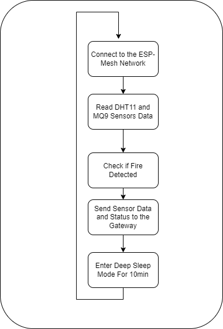
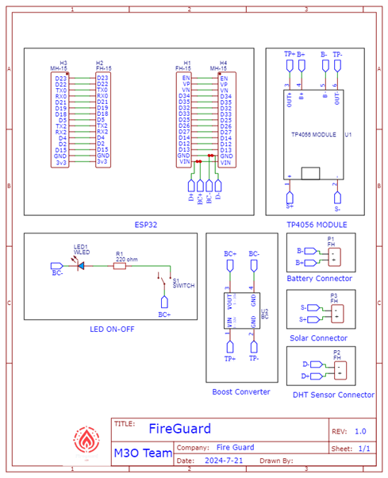
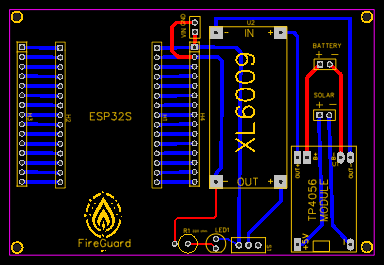
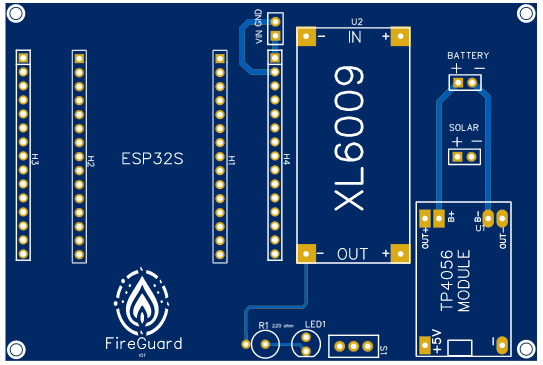
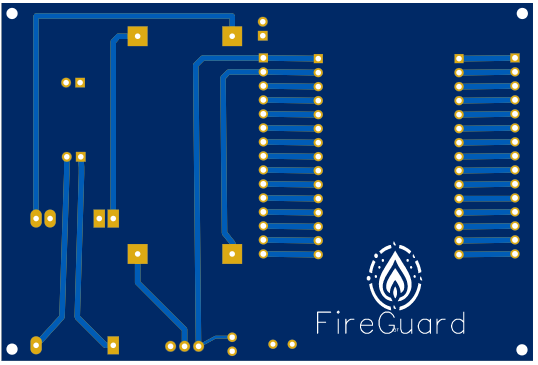
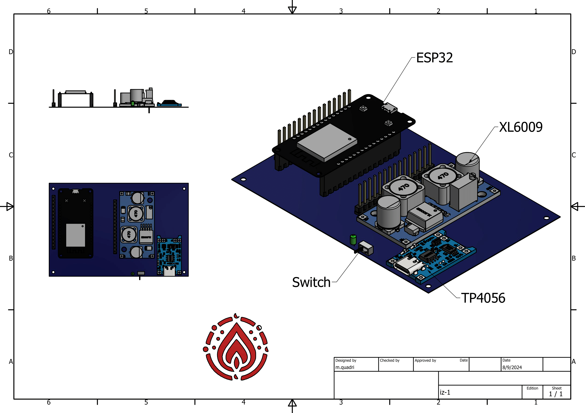
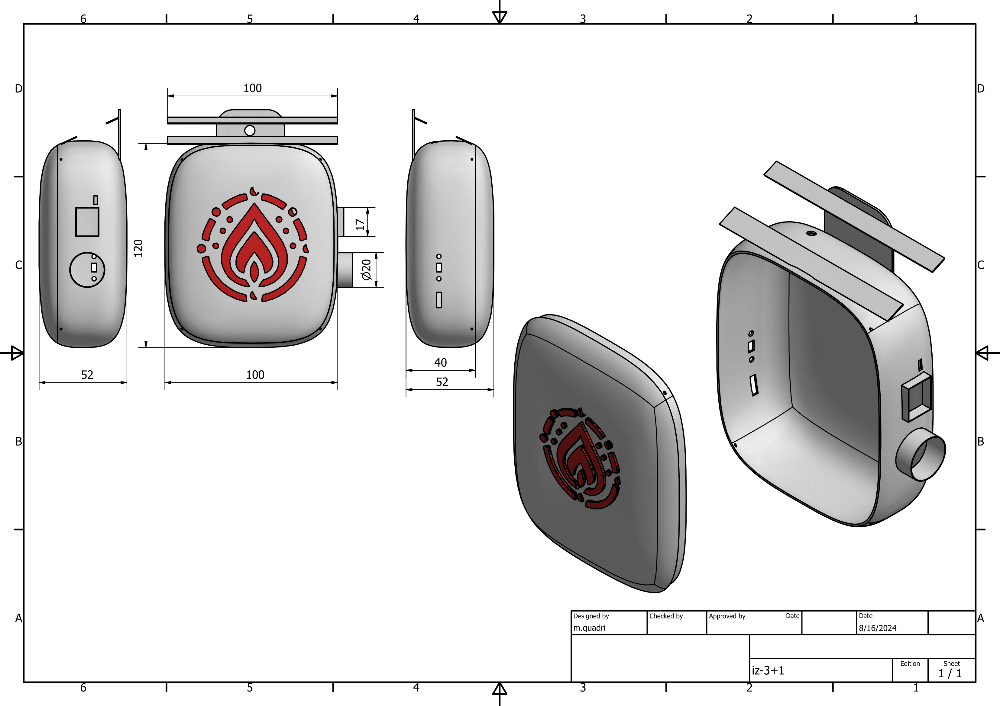
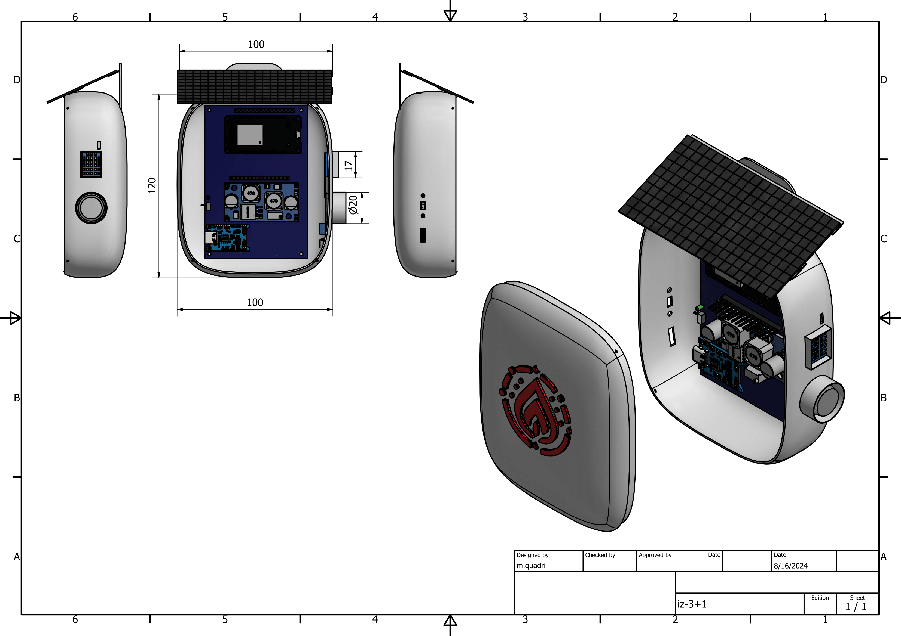
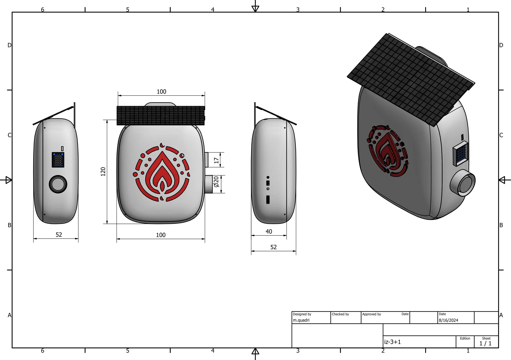
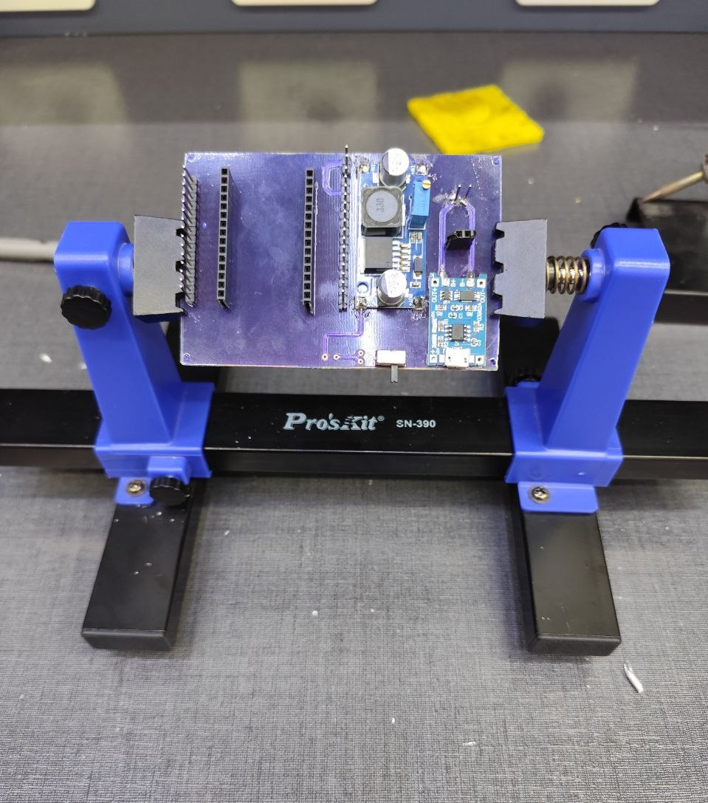

# Fireguard - Sensor Nodes 

  

**Project Name:** Fireguard - Forest Fire Detection System  
**Component:** Sensor Nodes  
**Date:** 2024  

This repository contains the design and implementation process of the **Sensor Nodes**, which are critical components of the **Fireguard** system. These nodes are responsible for collecting environmental data, detecting potential fire threats, and communicating with the system's gateway.

---

## Table of Contents
1. [Introduction](#introduction)
2. [The Design Process](#the-design-process)
   1. [Define the Process of the Device](#define-the-process-of-the-device)
   2. [Schematic Design](#schematic-design)
   3. [PCB Design](#pcb-design)
   4. [3D Design](#3d-design)
   5. [Power Consumption Study](#power-consumption-study)
3. [The Implementation Process](#the-implementation-process)
   1. [Device Software Development](#device-software-development)
   2. [PCB Printing](#pcb-printing)
   3. [3D Model Printing](#3d-model-printing)
   4. [Solar Panel Integration](#solar-panel-integration)
   5. [The First Prototype](#the-first-prototype)
4. [Conclusion](#conclusion)
5. [Future Updates](#future-updates)

---

## 1. Introduction 
The sensor nodes are the core elements of the **Fireguard** system, responsible for detecting early signs of forest fires. Each sensor node measures environmental data like temperature and gas concentration and sends it to the gateway. These nodes are designed to be low-power, durable, and capable of operating in remote forest areas, powered by solar panels.

---

## 2. The Design Process 

### 2.1 Define the Process of the Device 

  

The process flow of the sensor node involves:
1. **Data Collection**: Sensors like DHT11 (Temperature,Humidity) and MQ9 (CO gas) are used to monitor environmental conditions.
2. **Data Processing**: The node performs edge computing to analyze data locally, determining if the fire conditions are met.
3. **Communication**: The node sends sensor data and status updates to the gateway using Wi-Fi (PainlessMesh library).
4. **Power Management**: Nodes enter deep sleep mode to conserve energy and operate on solar power.

### 2.2 Schematic Design 

  

The electronic design of the sensor node was created using EasyEDA. The primary components include:
- **ESP32**: Controls the sensors and manages communication.
- **DHT11**: Measures temperature.
- **MQ9**: Detects gas levels.
- **XL6009**: Regulates voltage for the ESP32.
- **TP4056**: Handles charging of the 5000mAh lithium battery, either through USB during testing or using a solar panel in the field.

### 2.3 PCB Design 

  

  
   

After finalizing the schematic, we designed the **PCB** to integrate all components efficiently and minimize size. The design was exported as Gerber files, ready for PCB manufacturing.

### 2.4 3D Design 
To protect the sensor node from environmental conditions (e.g., rain, dust), we designed a 3D model of the case using **Autodesk Inventor**. The enclosure provides protection for both the PCB and sensors while ensuring airflow for accurate sensor readings.

  

  

  

  

### 2.5 Power Consumption Study 
A simple study was conducted to estimate power consumption and optimize battery life. To achieve this, we:
- Used **deep sleep mode** to minimize power draw when the node is not transmitting.
- Selected low-power components, including a 5000mAh lithium battery charged by **2W solar panels**.

This design allows the sensor nodes to operate in remote areas with minimal maintenance.

---

## 3. The Implementation Process 

### 3.1 Device Software Development 
We implemented the software for the sensor nodes using **Arduino IDE**. The code follows a modular structure, separating different functionalities into headers and CPP files for easier debugging and updates. The workflow for the device is as follows:
1. Connect to the **ESP mesh network** using Wi-Fi (PainlessMesh library).
2. **Read sensor data** from DHT11 and MQ9.
3. Perform **edge computing** to determine if fire conditions are met using **thresholding** (planned future update: integrate **TinyML** for enhanced fire detection).
4. **Send sensor data** and status to the gateway.
5. Enter **deep sleep mode** to conserve power, then repeat the process at the next cycle.

### 3.2 PCB Printing 
We exported the Gerber files and sent them for PCB fabrication. Once the PCBs were printed, we assembled the components, tested the connections, and verified functionality.

  

### 3.3 3D Model Printing 
The 3D case designed in **Autodesk Inventor** was printed using a 3D printer. The case was built to protect the PCB and ensure long-term durability in forest conditions.

### 3.4 Solar Panel Integration 
We integrated a **2W solar panel** to ensure continuous operation in the field. The panel charges the **5000mAh lithium battery** via the **TP4056 charging module**. The combination of deep sleep mode and solar power ensures that the node can function for long periods without maintenance.

### 3.5 The First Prototype 
For the first prototype, we chose the **DHT11** and **MQ9** sensors based on research papers focused on forest fire detection systems. We used **ESP32** for its built-in Wi-Fi and low power capabilities, as well as its ability to communicate with the gateway.

After assembling the circuit on a test board and programming it using **Arduino IDE**, we separated the code into headers and CPP files to improve readability and make debugging easier.

The first prototype successfully:
- Connected to the ESP mesh network.
- Collected sensor data.
- Performed simple threshold-based fire detection.
- Sent data to the gateway.
- Entered deep sleep mode to conserve energy.

While still in the development phase, this prototype is stable and functional, allowing us to share a working version of the sensor node.

---

## 4. Conclusion 
The **Fireguard sensor node** is a robust and energy-efficient device that provides real-time data on environmental conditions in forests, helping detect fires early. Our first prototype demonstrates the system's viability, and future updates will improve the detection accuracy and energy efficiency even further.

---

## 5. Future Updates 
In future updates, we plan to:
1. Integrate **TinyML** for more accurate fire detection using machine learning on the edge.
2. Refine the power management system to further extend battery life.
3. Add additional sensors to improve data accuracy (e.g., humidity sensors).
4. Optimize the PCB design for more compact, cost-effective production.

We are excited to continue developing this solution and enhancing its capabilities.

---

We hope this information is useful for developers and researchers interested in IoT-based forest fire detection systems. Feel free to explore the repository and provide feedback!

